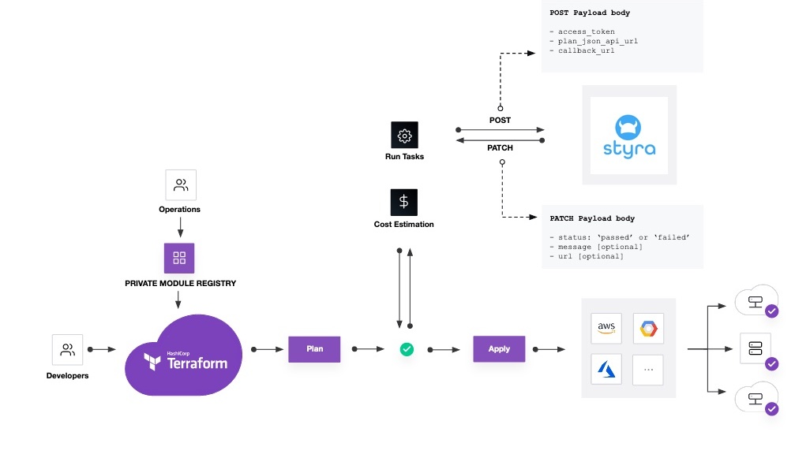

# Styra DAS Terraform Cloud Run Task Integration Tutorial

This repositories accompanies the [Styra DAS Terraform System Type documentation](https://docs.styra.com/systems/use-cases/terraform/overview) the [tutorial for integrating Terraform Cloud with Styra DAS](https://docs.styra.com/tutorials/terraform-cloud/introduction) by using Terraform Cloud run tasks. The tutorial along with this codebase will help you set up DAS policy guardrails for a demo Terraform Cloud workspace.

New to Styra DAS? Try out the Terraform Cloud integration by signing up for the [Styra DAS Free plan](https://www.styra.com/das-free).

> Note: The run task feature in Terraform Cloud is only available to Terraform Cloud organizations on the Team & Governance or Business plans.

New to Open Policy Agent's Rego policy language? Check out Styra's [Rego Style Guide](https://github.com/StyraInc/rego-style-guide).

## Architecture

Styra DAS integrations with your Terraform Cloud workspaces using [run tasks](https://www.terraform.io/cloud-docs/workspaces/settings/run-tasks), ensuring resource changes are evaluated against policy guardrails defined in DAS before Terraform applies those changes. Below is an overview diagram of the run task integration.

## Repository Contents

In this repository you'll find the code which configures your Terraform Cloud workspace and uses the fictitious Terraform [Fake Web Services provider](https://registry.terraform.io/providers/hashicorp/fakewebservices/latest) to create a [fakewebservices_vpc](https://registry.terraform.io/providers/hashicorp/fakewebservices/latest/docs/resources/vpc) resource for demonstration purposes without needing a cloud provider account.

To give you an idea about what policy for Terraform and Terraform Cloud might look like, this repository provides several example policies in the following directories:

* `policy/fws/vpc`: Fake Web Services provider's VPC Terraform resource policies
* `policy/tfc/runs`: General Terraform Cloud run policies

Additionally, you can use any policies from Styra's [Terrform Policy Library](https://docs.styra.com/systems/use-cases/terraform/snippets) within DAS.
